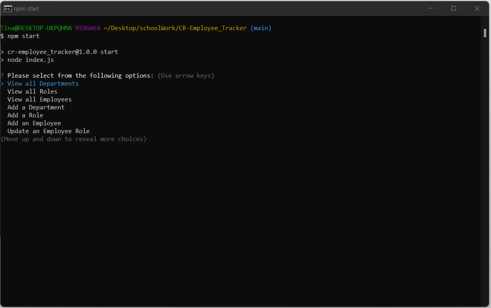
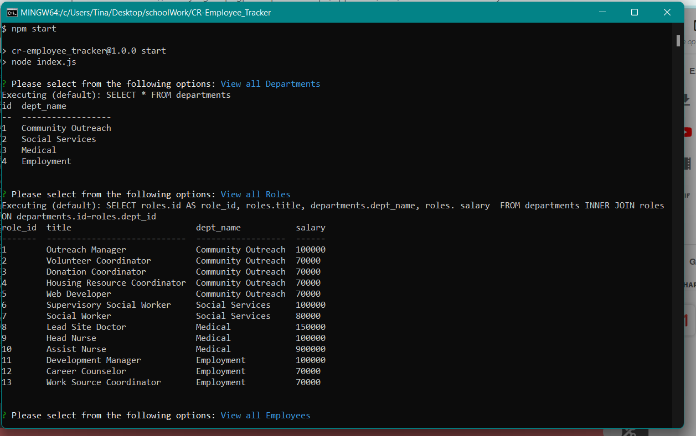

# Employee Tracker Application

Check out the Employee Tracker Application repo [here](https://github.com/ChannellNumber5/CR-Employee_Tracker) on Github!

## Description
This is a command line application that helps users organize their company's information. The application uses inquirer to prompt and take in the user's information and choices and then uses MySql to store the user's company information. It can be used to track departments, roles/positions in the company, and employees within the company.

The hardest part about this application was switching between javascript and SQL, knowing how to merge the two together, so that they worked with executing the right queries in the right order. Also, it was definitely a learning curve to use table aliases, when referencing and joining information from the same tables.

## User Instructions
The user will need some sort of command line application, whether it's terminal or git bash, or something like that. The user will also need to use node package manager (npm) and MySQL. Once they have those loaded, they will then need to source the schema.sql file, to create the new company database and then they can begin creating/tracking their company.

Check out the tutorial video [here](https://youtu.be/MOk5aH9ybxU)!

Once running, the application should show the user this menu:

Then, here is a screenshot after choosing the option to view all departments and then to view all roles:

## Credits

## License
MIT

## Resources
- Git Branch Conflict Solution[Merging Unrelated Histories](https://komodor.com/learn/how-to-fix-fatal-refusing-to-merge-unrelated-histories-error/)

- [Foreign Keys Referencing Same Table](https://stackoverflow.com/questions/18680680/can-a-foreign-key-refer-to-a-primary-key-in-the-same-table)

- [console.table npm package](https://www.npmjs.com/package/console.table)

- [Sequelize Queries](https://sequelize.org/docs/v6/core-concepts/raw-queries/)
- [Table Aliases and Self Join](https://www.sqlservertutorial.net/sql-server-basics/sql-server-self-join/#:~:text=SQL%20Server%20self%20join%20syntax&text=It%20helps%20query%20hierarchical%20data,same%20table%20within%20the%20query.)
- [Using SUM and CASE](https://stackoverflow.com/questions/13075505/mysql-is-it-possible-to-sum-if-or-to-count-if)
- [TypeOf](https://developer.mozilla.org/en-US/docs/Web/JavaScript/Reference/Operators/typeof)
- [Update data in mySQL](https://www.w3schools.com/mysql/mysql_update.asp)